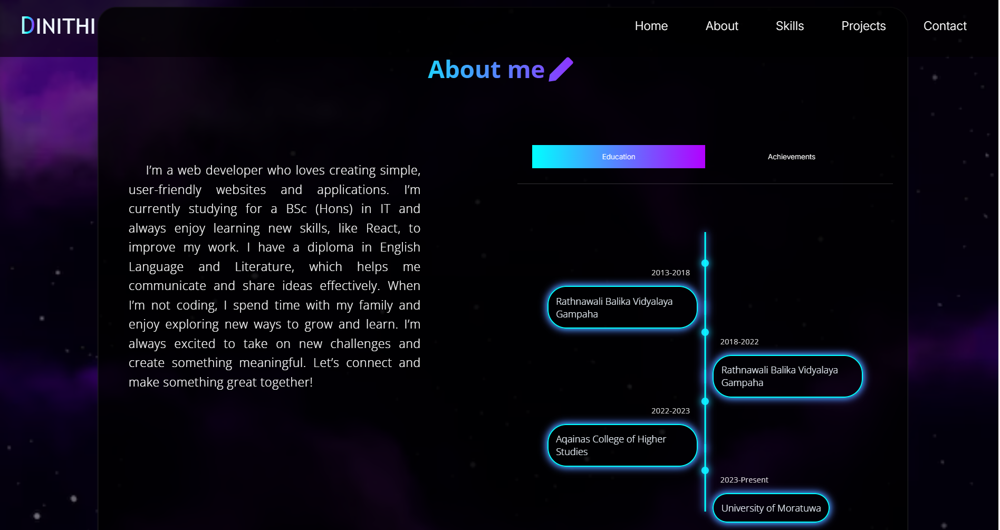

# Portfolio Website

This is my personal portfolio website built using **React.js**. It showcases my skills, projects, and contact details. I have used **Formspree** to handle form submissions and send emails directly from the website.

## Features

- **Responsive Design**: The website is fully responsive and optimized for both mobile and desktop views.
- **Project Showcases**: A section where I highlight the projects I've worked on.
- **Contact Form**: A contact form powered by **Formspree**, allowing users to send emails directly through the website.
- **About Me**: A brief introduction about myself, including my skills and experience.

## Technologies Used

- **React.js**: JavaScript library for building the user interface.
- **Formspree**: A service used for handling form submissions.
- **CSS**: Styling the website to ensure a pleasant and user-friendly experience.
- **HTML**: Structuring the content of the site.

## Screenshots

Here are some screenshots of the website:

### Desktop View




## Demo

You can view the live demo of the website here:  
[**Portfolio Demo**](https://dinithi1625403.github.io/myPortfolio/index.html)

## Setup Instructions

To run this project locally, follow these steps:

### 1. Clone the repository

Open your terminal and run the following command to clone the repository:

```bash
git clone https://github.com/dinithi1625403/myPortfolio.git
